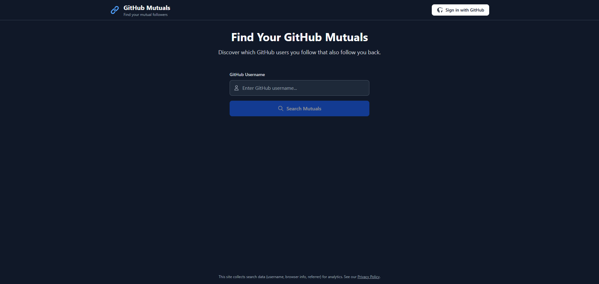
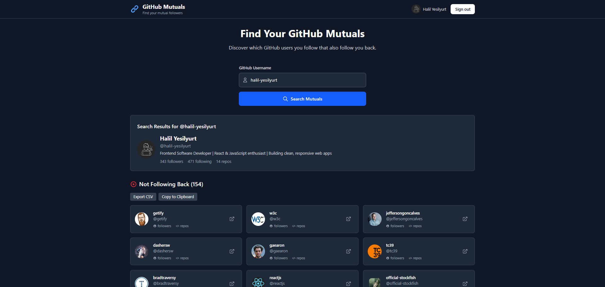
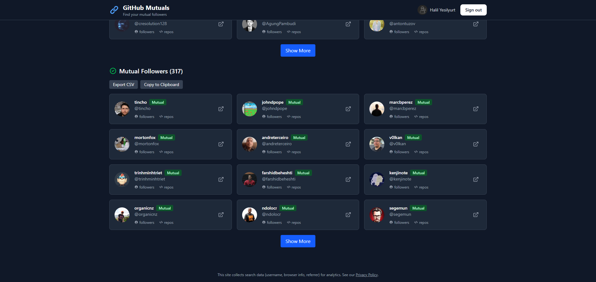

# GitHub Mutuals


---

## Overview

**GitHub Mutuals** is a modern web app that helps you discover which GitHub users you follow also follow you back. Search by username (no login required) or sign in with GitHub for more accurate results and higher API limits. Every search is saved to Firebase for analytics and tracking.

---

## 🚀 Features

### 🔐 Authentication

- Sign in with GitHub (OAuth) for higher API rate limits and session persistence
- Or search by any public GitHub username without logging in

### 🔍 Search & Analysis

- Fetches both `followers` and `following` lists for a username
- Compares and displays:
  - ✅ **Mutual followers** (users you follow who follow you back)
  - ❌ **Not following back** (users you follow who don't follow you back)
- Handles large lists with pagination ("Show More")
- Loading spinners and error messages for invalid usernames, rate limits, etc.

### 📦 Data Persistence

- Every search is saved to Firebase Firestore with:
  - `username` (searched)
  - `timestamp`
  - `userId` (if signed in)
  - `userAgent`, `referrer` (for analytics)

### 🧑‍🎨 UI/UX

- Responsive, modern design with Tailwind CSS
- List view with avatars, usernames, and profile links
- Export results to CSV or clipboard
- Privacy policy and data collection notice

---

## 📸 App Screenshots & Demo

<p align="center">
   <b>Main Page – Search and Overview</b><br/>
  
</p>

<p align="center">
    <b>Signed-in: Users You Follow Who Don't Follow Back</b><br/>
  
</p>

<p align="center">
  <b>Mutual Followers – Users Who Follow Each Other</b><br/>
  
</p>

---

## 🛠️ Tech Stack

- **Frontend:** React, TypeScript, Vite, Tailwind CSS, PostCSS
- **Routing:** React Router DOM
- **Authentication & Database:** Firebase Auth (GitHub), Firestore
- **API:** GitHub REST API
- **Build Tools:** Node.js, npm, tsc, Rollup (via Vite)
- **Linting:** ESLint
- **Documentation:** Markdown
- **Version Control:** Git

---

## ⚡ Getting Started

### Prerequisites

- [Node.js](https://nodejs.org/) (v16+ recommended)
- [npm](https://www.npmjs.com/) or [yarn](https://yarnpkg.com/)
- [Git](https://git-scm.com/)

### Installation

1. **Clone the repository:**
   ```bash
   git clone https://github.com/halil-yesilyurt/github-mutuals.git
   cd github-mutuals
   ```
2. **Install dependencies:**
   ```bash
   npm install
   # or
   yarn install
   ```
3. **Set up Firebase & GitHub OAuth:**
   - Create a Firebase project ([guide](FIREBASE_SETUP.md))
   - Enable GitHub Auth and Firestore in Firebase
   - Create a GitHub OAuth App and add credentials to Firebase Auth
   - Copy your Firebase config to a `.env` file:
     ```env
     VITE_FIREBASE_API_KEY=your-api-key
     VITE_FIREBASE_AUTH_DOMAIN=your-auth-domain
     VITE_FIREBASE_PROJECT_ID=your-project-id
     VITE_FIREBASE_STORAGE_BUCKET=your-storage-bucket
     VITE_FIREBASE_MESSAGING_SENDER_ID=your-messaging-sender-id
     VITE_FIREBASE_APP_ID=your-app-id
     ```
4. **Start the development server:**
   ```bash
   npm run dev
   # or
   yarn dev
   ```

---

## 📁 Project Structure

```
├── public/                # Static assets (screenshots, icons)
├── src/
│   ├── components/        # React components (Header, SearchForm, UserCard)
│   ├── contexts/          # React contexts (Auth, Theme)
│   ├── services/          # API services (firebase, github)
│   ├── types.ts           # TypeScript types
│   ├── firebase.ts        # Firebase config
│   ├── App.tsx            # Main app component
│   └── main.tsx           # App entry point
├── README.md
├── package.json
└── ...
```

---

## ⏳ API Rate Limits & Considerations

- **GitHub REST API rate limits:**
  - Unauthenticated: **60 requests/hour**
  - Authenticated: **5,000 requests/hour**
- You can only check "who follows you" for other users if you are logged in as them (GitHub API limitation)

---

## 🤝 Contributing

Contributions are welcome! To contribute:

1. Fork the repository
2. Create a new branch: `git checkout -b feature/your-feature`
3. Commit your changes: `git commit -m 'Add feature'`
4. Push to your branch: `git push origin feature/your-feature`
5. Open a Pull Request

---

## 📄 License

This project is licensed under the MIT License. See the [LICENSE](LICENSE) file for details.

---

## 💬 Contact / Support

For questions, suggestions, or support, please [open an issue](https://github.com/halil-yesilyurt/github-mutuals/issues).

---

## 🙏 Acknowledgments

- GitHub API
- Firebase
- Tailwind CSS
- React

---

**Made with ❤️ by [halil-yesilyurt](https://github.com/halil-yesilyurt)**
